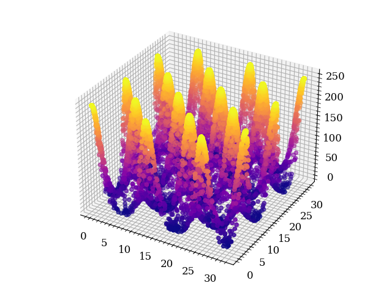

inknest
=======

An ensemble nested sampling implementation using the *stretch-move-based* affine invariant ensemble sampler `(Goodman & Weare, 2010) <https://msp.org/camcos/2010/5-1/camcos-v5-n1-p04-p.pdf>`_.

For an explaination of the algorithm see ``conceptual_notes.pdf``, for the code user guide see ``documentation\build\inknest.pdf``

.. warning ::
    Due to multiprocessing problems v1.0 works only under unix-based OSs.

<<<<<<< HEAD:README.md

=======

>>>>>>> 78ce2a5172485a141cef40d6256af0b62688d0dd:README.rst
