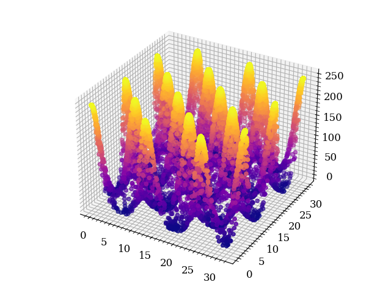
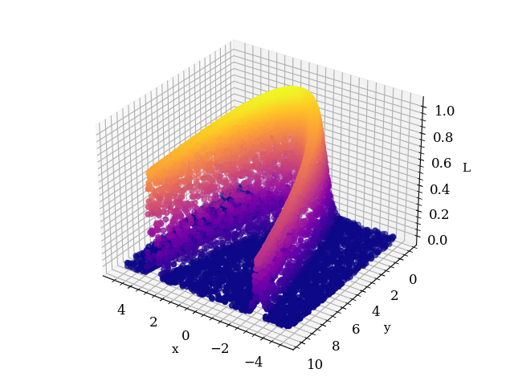
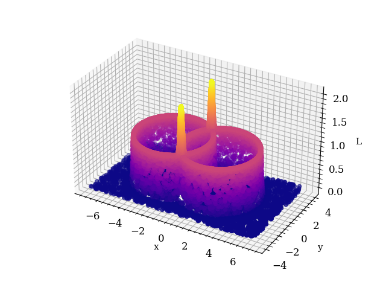

# ensnest

An ensemble nested sampling implementation using the *stretch-move-based* affine invariant ensemble sampler [(Goodman & Weare, 2010)](https://msp.org/camcos/2010/5-1/camcos-v5-n1-p04-p.pdf)

> **WARNING**: Due to multiprocessing issues v1.0 works only under unix-based OSs.


## Notable features
- low tuning necessary
- multimodal is ok
- multiprocessed
- lots of progress bars

## Installation and docs

Install with

```console
$ python3 setup.py install
```

Documentation can be generated using ``Sphinx`` in the ``documentation`` directory

```console
documentation:~$ make html
```

## Examples

### Eggbox model

(true) logZ = 235.88

(computed) logZ = 235.91 +- 0.05

in 37s




### Rosenbrock function

(true) logZ = -2.17

(computed) logZ = -2.16 +- 0.02

in 25s




### Gaussian shells

(true) logZ = -2.47

(computed) logZ = -2.44 +- 0.03

in 62s


